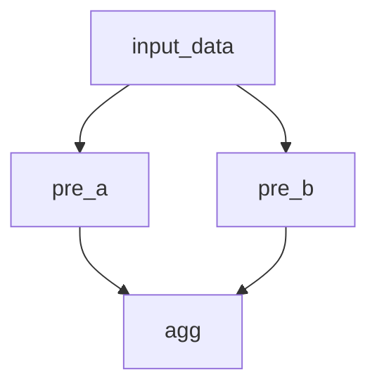

# Distributed Execution

This guide explains how to execute Handoff DAGs across multiple Elixir nodes for improved performance and scalability.

## Prerequisites

- A working Elixir cluster with connected nodes
- Handoff installed on all nodes
- Basic understanding of Handoff DAGs (see [Getting Started](getting_started.md))

## Setting Up Nodes

Before executing a DAG in a distributed environment, you need to set up your nodes:

```elixir
# On each node, start Handoff
Handoff.start()

# Register the local node with its capabilities
Handoff.register_local_node(%{
  cpu: 8,        # 8 CPU cores
  memory: 16000, # 16GB memory
  gpu: 1         # 1 GPU unit
})
```

### Node Discovery

Handoff provides automatic node discovery within a connected Erlang cluster:

```elixir
# Discover all nodes in the cluster and register their capabilities
{:ok, discovered_nodes} = Handoff.discover_nodes()

# See what nodes are available and their resources
IO.inspect(discovered_nodes)
# Example output:
# %{
#   :"node1@192.168.1.100" => %{cpu: 8, memory: 16000, gpu: 1},
#   :"node2@192.168.1.101" => %{cpu: 4, memory: 8000},
#   :"node3@192.168.1.102" => %{cpu: 16, memory: 32000, gpu: 2}
# }
```

## Resource-Aware Functions

To take advantage of distributed execution, define functions with resource requirements:

```elixir
alias Handoff.Function

# CPU-intensive function
cpu_heavy_fn = %Function{
  id: :cpu_intensive,
  args: [:input_data],
  code: &SomeModule.heavy_computation/1,
  cost: %{cpu: 4, memory: 2000}  # Requires 4 CPU cores, 2GB memory
}

# GPU-accelerated function
gpu_fn = %Function{
  id: :gpu_task,
  args: [:preprocessed_data],
  code: &SomeModule.gpu_computation/1,
  cost: %{gpu: 1, memory: 4000}  # Requires 1 GPU, 4GB memory
}
```

## Distributed Execution

Execute your DAG across the cluster using `execute_distributed`:

```elixir
# Build and validate your DAG
dag =
  Handoff.new()
  |> Handoff.DAG.add_function(source_fn)
  |> Handoff.DAG.add_function(cpu_heavy_fn)
  |> Handoff.DAG.add_function(gpu_fn)
  |> Handoff.DAG.add_function(aggregation_fn)

:ok = Handoff.DAG.validate(dag)

# Execute the DAG across the cluster
{:ok, results} = Handoff.execute_distributed(dag, max_retries: 3)
```

## Fault Tolerance

Distributed execution in Handoff includes automatic fault tolerance:

- Task retry on failure (configurable with `max_retries`)
- Node failure detection
- Result synchronization across nodes

If a node fails during execution, its tasks will be reassigned to other suitable nodes.

## Example: Branching DAG for Distributed Execution

You can execute more complex, tree-like DAGs across your cluster. For example, suppose you want to preprocess data in two different ways before aggregating the results:

```elixir
# Install dependency in your mix.exs:
#   {:handoff, "~> 0.1"}

# Handoff requires fully qualified function captures for :code and extra_args.
defmodule Transformations do
  def inc(x), do: x + 1
  def double(x), do: x * 2
  def sum_two_lists(a, b), do: Enum.sum(a) + Enum.sum(b)
end

alias Handoff.Function

dag = Handoff.new()

source_fn = %Function{
  id: :input_data,
  args: [],
  code: &Elixir.Function.identity/1,
  extra_args: [[10, 20, 30]]
}

preprocess_a = %Function{
  id: :pre_a,
  args: [:left],
  code: &Enum.map/2,
  extra_args: [&Transformations.inc/1],
  cost: %{cpu: 2}
}

preprocess_b = %Function{
  id: :right,
  args: [:input_data],
  code: &Enum.map/2,
  extra_args: [&Transformations.double/1],
  cost: %{cpu: 2}
}

aggregate = %Function{
  id: :agg,
  args: [:left, :right],
  code: &Transformations.sum_two_lists/2,
  cost: %{cpu: 1}
}

dag =
  dag
  |> Handoff.DAG.add_function(source_fn)
  |> Handoff.DAG.add_function(preprocess_a)
  |> Handoff.DAG.add_function(preprocess_b)
  |> Handoff.DAG.add_function(aggregate)

:ok = Handoff.DAG.validate(dag)
```

> **Note:** Handoff requires all function references in :code and extra_args to be fully qualified (e.g., &Module.function/arity), not anonymous functions.

This DAG structure looks like:


