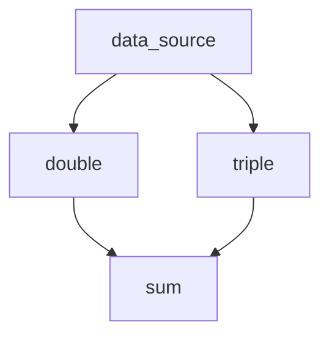

# Getting Started with Handoff

This guide will help you get started with Handoff, a library for building and executing Directed Acyclic Graphs (DAGs) of functions in Elixir.

## Installation

Add `handoff` to your list of dependencies in `mix.exs`:

```elixir
def deps do
  [
    {:handoff, "~> 0.1.0"}
  ]
end
```

Then run:

```bash
mix deps.get
```

## Basic Usage

### Starting Handoff

Handoff is started by default when included as a dependency. `Handoff.start` is available for more granular control.

### Creating a Simple DAG

Let's create a simple computation graph:

```elixir
alias Handoff.Function

# Create a new DAG
dag = Handoff.new()

# Define a source function with no dependencies
source_fn = %Function{
  id: :data_source,
  args: [],
  code: &Elixir.Function.identity/1
  extra_args: [[1, 2, 3, 4, 5]]
}

defmodule MyModule do
  def double(x) do
    x * 2
  end
end

# Define a transformation function
transform_fn = %Function{
  id: :double,
  args: [:data_source],
  code: &Enum.map/2,
  extra_args: [&MyModule.double/1]
}

# Define a final aggregation function
aggregate_fn = %Function{
  id: :sum,
  args: [:double],
  code: &Enum.sum/1,
  argument_inclusion: :as_list # this will pass the list of arguments as a single list argument
}

# Add functions to the DAG
dag =
  dag
  |> Handoff.DAG.add_function(source_fn)
  |> Handoff.DAG.add_function(transform_fn)
  |> Handoff.DAG.add_function(aggregate_fn)

# Validate the DAG
:ok = Handoff.DAG.validate(dag)
```

### Executing the DAG

```elixir
# Execute the DAG
{:ok, results} = Handoff.execute(valid_dag)

# Access the final result
sum_result = results[:sum]
IO.puts("The sum is: #{sum_result}")  # Output: The sum is: 30
```

## Using Extra Arguments

You can provide additional arguments to functions at execution time:

```elixir
# Define a function that uses extra arguments
parametrized_fn = %Function{
  id: :parametrized,
  args: [:data_source],
  code: &IO.inspect/2,
  extra_args: [[label: "inspected with options"]]
}
```

## Error Handling

Handoff provides proper error handling during validation and execution:

```elixir
# DAG with missing dependencies
invalid_dag =
  Handoff.new()
  |> Handoff.DAG.add_function(%Function{
    id: :invalid,
    args: [:non_existent],  # This dependency doesn't exist
    code: &SomeModule.some_function/1
  })

case Handoff.DAG.validate(invalid_dag) do
  :ok ->
    IO.puts("DAG is valid")

  {:error, {:missing_function, missing}} ->
    IO.puts("DAG has missing function: #{inspect(missing)}")
end
```

## Example: Branching (Tree-like) DAG

Let's create a DAG where a single data source feeds two parallel transformations, and their results are then aggregated:

```elixir
# Define transformation functions in a dedicated module
defmodule Transformations do
  def identity(x), do: x
  def double(x), do: x * 2
  def triple(x), do: x * 3
  def sum_two_lists(d, t), do: Enum.sum(d) + Enum.sum(t)
end

alias Handoff.Function

dag = Handoff.new()

# Source node
data = [1, 2, 3, 4, 5]
source_fn = %Function{
  id: :data_source,
  args: [],
  code: &Transformations.identity/1,
  extra_args: [data]
}

# Two parallel transformations
transform_double = %Function{
  id: :double,
  args: [:data_source],
  code: &Enum.map/2,
  extra_args: [&Transformations.double/1]
}

transform_triple = %Function{
  id: :triple,
  args: [:data_source],
  code: &Enum.map/2,
  extra_args: [&Transformations.triple/1]
}

# Aggregation node
aggregate_fn = %Function{
  id: :sum,
  args: [:double, :triple],
  code: &Transformations.sum_two_lists/2
}

dag =
  dag
  |> Handoff.DAG.add_function(source_fn)
  |> Handoff.DAG.add_function(transform_double)
  |> Handoff.DAG.add_function(transform_triple)
  |> Handoff.DAG.add_function(aggregate_fn)

:ok = Handoff.DAG.validate(dag)
dag

{:ok, results} = Handoff.execute(dag)

IO.inspect(results, label: "All results")
IO.puts("The sum is: #{results[:sum]}")
```

This DAG has a tree-like structure:




## Next Steps

Now that you understand the basics of Handoff, you might want to explore:

- [Distributed Execution](distributed_execution.md) - Execute your DAGs across multiple nodes
- [Resource Management](resource_management.md) - Define and manage computational resources
